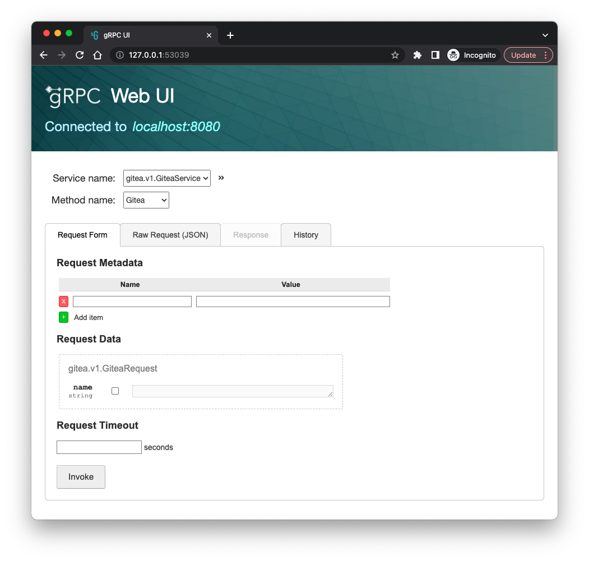
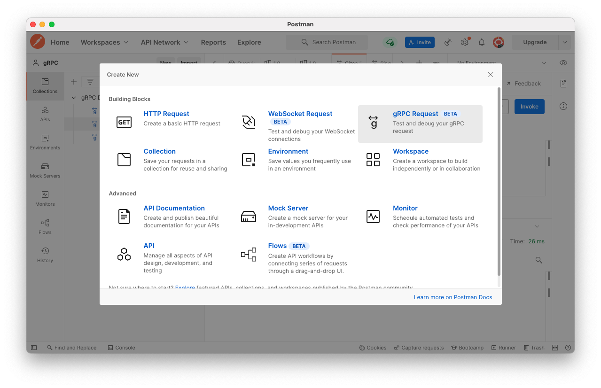

# proto-go-sample

[](https://github.com/go-training/proto-go-sample/actions/workflows/build.yaml)

Sample Code for proto connect.

## Build Server and Client

```sh
make build
```

## Start server

### [Chi](https://github.com/go-chi/chi)

```sh
$ ./bin/chi-server
2022/08/12 21:52:47 Got connection: HTTP/1.1
2022/08/12 21:52:47 Request headers:  map[Accept:[*/*] Content-Length:[18] Content-Type:[application/json] User-Agent:[curl/7.71.1]]
2022/08/12 21:52:47 "POST http://localhost:8080/proto.v1.GiteaService/Gitea HTTP/1.1" from [::1]:52974 - 200 29B in 1.22325ms
2022/08/12 21:53:00 Got connection: HTTP/2.0
2022/08/12 21:53:00 Got connection: HTTP/2.0
2022/08/12 21:53:00 Request headers:  map[Content-Type:[application/grpc] Te:[trailers] User-Agent:[grpcurl/dev-build (no version set) grpc-go/1.44.1-dev]]
2022/08/12 21:53:00 "POST http://localhost:8080/proto.v1.GiteaService/Gitea HTTP/2.0" from [::1]:52984 - 200 21B in 579.208µs
2022/08/12 21:53:00 "POST http://localhost:8080/grpc.reflection.v1alpha.ServerReflection/ServerReflectionInfo HTTP/2.0" from [::1]:52984 - 200 292B in 2.856292ms
```

### [Gin](https://github.com/gin-gonic/gin)

```sh
$ ./bin/gin-server
[GIN-debug] [WARNING] Creating an Engine instance with the Logger and Recovery middleware already attached.

[GIN-debug] [WARNING] Running in "debug" mode. Switch to "release" mode in production.
 - using env:   export GIN_MODE=release
 - using code:  gin.SetMode(gin.ReleaseMode)

[GIN-debug] POST   /proto.v1.GiteaService/:name --> main.giteaHandler.func1 (3 handlers)
[GIN-debug] POST   /grpc.reflection.v1.ServerReflection/:name --> main.giteaHandler.func1 (3 handlers)
[GIN-debug] POST   /grpc.reflection.v1alpha.ServerReflection/:name --> main.giteaHandler.func1 (3 handlers)
[GIN-debug] POST   /grpc.health.v1.Health/:name --> main.giteaHandler.func1 (3 handlers)
[GIN-debug] [WARNING] You trusted all proxies, this is NOT safe. We recommend you to set a value.
Please check https://pkg.go.dev/github.com/gin-gonic/gin#readme-don-t-trust-all-proxies for details.
[GIN-debug] Listening and serving HTTP on :8080
2022/08/12 21:41:31 Got connection: HTTP/1.1
2022/08/12 21:41:31 Request headers:  map[Accept:[*/*] Content-Length:[18] Content-Type:[application/json] User-Agent:[curl/7.71.1]]
[GIN] 2022/08/12 - 21:41:31 | 200 |    1.829041ms |             ::1 | POST     "/proto.v1.GiteaService/Gitea"
2022/08/12 21:41:39 Got connection: HTTP/2.0
2022/08/12 21:41:39 Got connection: HTTP/2.0
2022/08/12 21:41:39 Request headers:  map[Content-Type:[application/grpc] Te:[trailers] User-Agent:[grpcurl/dev-build (no version set) grpc-go/1.44.1-dev]]
[GIN] 2022/08/12 - 21:41:39 | 200 |     492.917µs |             ::1 | POST     "/proto.v1.GiteaService/Gitea"
[GIN] 2022/08/12 - 21:41:39 | 200 |    3.752833ms |             ::1 | POST     "/grpc.reflection.v1alpha.ServerReflection/ServerReflectionInfo"
```

## Start client

run client with [Go](https://go.dev)

```sh
$ ./bin/client
2022/08/12 10:05:00 Message: Hello, foobar!
2022/08/12 10:05:00 Gitea-Version: v1
```

run client with curl command

```sh
curl --header "Content-Type: application/json" \
    --data '{"name": "foobar"}' \
    http://localhost:8080/gitea.v1.GiteaService/Gitea
```

health check

```sh
curl --header "Content-Type: application/json" \
    --data '{"service": "gitea.v1.GiteaService"}' \
    http://localhost:8080/grpc.health.v1.Health/Check
```

## Testing

### Use grpcurl

run client with [grpcurl](https://github.com/fullstorydev/grpcurl) command

```sh
grpcurl \
  -plaintext \
  -d '{"name": "foobar"}' \
  localhost:8080 \
  gitea.v1.GiteaService/Gitea
```

health check

```sh
grpcurl \
  -plaintext \
  -d '{"service": "gitea.v1.GiteaService"}' \
  localhost:8080 \
  grpc.health.v1.Health/Check
```

### Use grpcui

```sh
grpcui -plaintext localhost:8080
```



### Use Postman


